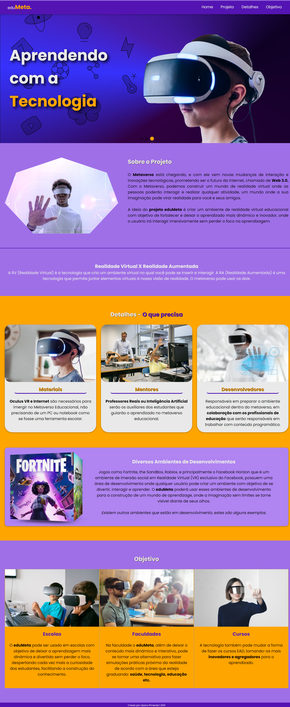

# Site eduMeta - Educação no Metaverso.

Desenvolvendo um site usando em HTML/CSS/JavaScript. Para a entrega do Desafio proposto pela RocketSeat DoWhile 2021, em que consiste criar uma landing page com o seguinte objetivo.

***"Pensando em construir o futuro, como você solucionaria os problemas de acesso à educação hoje, utilizando a tecnologia?"***

### Solução do Desafio
Usa a tecnologia do Metaverso para desenvolver e criar ambientes de Realidade aumentanda/virtual com objetivo de expandir o acesso como também inovar a forma de aprendizagem. Mais detalhes no <a href="https://edumeta.netlify.app/">site</a>.

### Requisitos

* Não usar nenhum framework - Reactjs, Vue.js, Angular...
* Usar obrigatoriamente HTML, CSS e JavaScript.
* Poder usar qualquer recursos de
* Não é necessário Back-end

### O que está sendo usado?
* Google Fonts - para fontes de texto;
* FontAwesome para ícones;
* SASS;
* HTML;
* Javascript;
* Swiper.js;
* Conceitos de Responsividade, Acessiblidade, Usabilidade e Semântica;
* Bancos de Images - Unsplash e Freepik
* Imagens redimensionadas no Figma, na tentativa de melhorar a performance em mobile. (As imagens vieram com dimensão 4k-8k 😲, desnecessário)
* [...]

**Site em Desenvolvimento**
- [x] Construir uma Barra de Navegação com Responsividade.
- [X] Construir uma Section Home usando o Swiper.js com Responsividade.
- [X] Construir uma Section que descreve a proposta do Projeto com Responsividade. 
- [X] Construir uma Section que dar detalhes da proposta com Responsividade. 
- [X] Construir uma Section que expande a ideia da proposta com Responsividade.
- [X] Construir um Footer de CopyRight.
- [X] Revisão e Manutenção do Site e Contextualização.
- [X] Site Finalizado!

**Resultado**

Link de acesso: https://edumeta.netlify.app/

**Data de ínicio de desenvolvimento - 09/12/2021** 
**Data de Termínio do desenvolvimento - 17/12/2021 - 13:42** 
**Data para entrega do Desafio até o dia 19/12/2021!**
